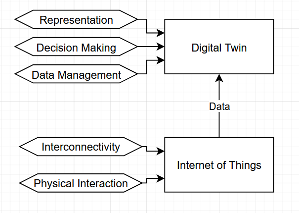

## Introduction

&nbsp;&nbsp;&nbsp;&nbsp;The rapid advancement of the Internet of Things (IoT) has enabled the integration of
physical devices into digital ecosystems, providing real-time data and enabling automation
across diverse domains, such as industry and agriculture, enabling the remote monitoring
and control of some processes. However, the increasing complexity of processes imposes
new challenges, such as the need for optimization, predictive capabilities, or simulations.
Those functionalities are beyond the field of IoT and require new solutions, where the
Digital Twin (DT) emerges, which proposes the creation of a virtual and dynamic representation of physical entities, enabling data analysis, simulations, and providing predictive
insights and optimization solutions.

&nbsp;&nbsp;&nbsp;&nbsp;In order to propose a DT solution, it’s important to understand the boundary between
IoT solutions and DT solutions, in addition to understanding the potential of DT in
enhancing IoT systems. The objective of this study is to, through a comparative analysis
between both solutions, determine the roles of each one, providing a better understanding
to create a more accurate system design.

## Analysis

&nbsp;&nbsp;&nbsp;&nbsp;The main problem about understanding the distinction between IoT and DT in the context of developing a DT is the difficulty in projecting a system design for the solution.
This study focuses on comparing both technologies to inform and guide the architectural
design of Digital Twin solutions, ensuring more coherent and efficient system development.

&nbsp;&nbsp;&nbsp;&nbsp;This study is based on the reading and analysis of scientific articles retrieved from the
Scopus database. From this analysis, the following data were extracted:
- The respective roles of IoT and DT;
- The differences between the two technologies;

&nbsp;&nbsp;&nbsp;&nbsp;The table [1](#tab1) presents the main roles of each technology. In the context of developing a
Digital Twin solution, it’s mandatory to interact with the physical object or process that is
being represented, that physical interaction is where IoT is the key to use devices, such as
sensors or controllers, to collect data or manipulate something [[1](#ref1)]. The connection between
different devices and internet, provides interconnectivity, which is another main role of
IoT, permitting several devices to exchange data between them and with the Internet [[2](#ref2)].
The several devices connected provides a vast amount of data that needs to be collected,
processed, and organized. This data management role belongs to DT, which, in order to
represent the physical entity, uses the data provided from the devices [[2](#ref2)]. Another main 
role required from a DT is decision-making, which consists of analyzing the data collected
in order to learn patterns and generate predictive insights for optimization, capabilities
that is achieved by incorporating Artificial Intelligence (AI) and Machine Learning (ML)
into the DT model [[1](#ref1)] [[2](#ref2)]. The data collected, organized, and analyzed provides an abstract
representation of the physical entity. This representation can be organized in several ways,
providing a visualization of important data in real-time and insights generated by DT,
the representation can also be organized to be interactive with a user, depending on the
application’s requirements. This role is also assigned to DT.

##### 
Table 1: Roles associated with IoT and DT technologies

|      | IoT                                      | Digital Twin (DT)                         |
|------|------------------------------------------|-------------------------------------------|
|**Roles** | Interconnectivity Physical interaction | Data management Decision making Representation |

&nbsp;&nbsp;&nbsp;&nbsp;The difference between IoT solutions and DT solutions is that IoT field is limited
to connecting several devices and collecting data from physical entities. This limitation
results in the need to use others technologies to complete the solution, such as visual
representations to visualize the collected data or AI and ML to analyze de data collected.
The DT purpose is to complete IoT solutions, using it as a component to collect data,
then manage the data collected by IoT to create the virtual representations, apply AI and
ML to provide insights, and implement a visual representation for a user to visualize and
interact with the digital model.

&nbsp;&nbsp;&nbsp;&nbsp;It’s important to understand that DT uses IoT as a component, therefore,
IoT is a key technology for the development of a DT solution, as it’s impossible to create
a virtual representation of a physical entity without physical interaction with the physical
entity and interconnectivity between the devices used for it.
<!--  -->

## Discussion

&nbsp;&nbsp;&nbsp;&nbsp;The analysis presented in Table 1 highlights the complementary relationship between Internet of Things (IoT) and Digital Twin (DT) technologies. While
both technologies are often mentioned together, they serve distinct purposes and operate
at different levels of abstraction within a system architecture.

&nbsp;&nbsp;&nbsp;&nbsp;IoT is fundamentally responsible for enabling interconnectivity and physical interaction with physical entities. IoT establishes the foundation upon which physical data
is continuously gathered and transmitted. However, as the text discusses, IoT alone is
limited to data acquisition and device connectivity. It does not provide mechanisms for
interpreting, analyzing, or visualizing that data in a meaningful or interactive way.

&nbsp;&nbsp;&nbsp;&nbsp;This limitation is precisely where the role of the Digital Twin becomes essential. DT
solutions build on IoT infrastructures by introducing capabilities for data management,
decision-making, and representation. A DT processes the raw data obtained through IoT,
creating a digital model of the physical entity and often integrating Artificial Intelligence
(AI) and Machine Learning (ML) to generate predictive insights. The outputs of this
digital model, such as data collected and insights generated, are usually projected in a
visual representation that permits a user to interact with the digital model.

&nbsp;&nbsp;&nbsp;&nbsp;Digital Twin is not an alternative to IoT, but rather an evolution or extension of
it. A DT system cannot exist without the foundational data and connectivity that IoT
provides.

## Conclusion

&nbsp;&nbsp;&nbsp;&nbsp;This study highlighted the complementary nature of IoT and Digital Twin technologies by
analyzing their distinct roles and responsibilities in the context of system design. While
IoT is essential for enabling interconnectivity and physical interaction, it is limited in its
capacity to support complex functionalities such as data analysis, decision-making, and
representation. Digital Twin emerges as a comprehensive solution that builds upon IoT
infrastructures, extending their capabilities to provide dynamic virtual representations
and intelligent insights. Understanding this boundary is crucial for designing effective DT
systems, as it ensures the proper integration of IoT components and the implementation
of higher-level functionalities. The comparative analysis presented serves as a foundation
for guiding the architectural design of future DT-based solutions.

## Bibliography

- **[1](#ref1)** P. Weichbroth, K. Jandy, and J. Zurada, “Toward sustainable development: Exploring the value and benefits of digital twins,” *Telecom*, vol. 5, pp. 774–791, Aug. 3, 2024. ISSN: 2673-4001. DOI: [10.3390/TELECOM5030039](https://doi.org/10.3390/TELECOM5030039).  
  [Online]. Available: [https://www.mdpi.com/2673-4001/5/3/39](https://www.mdpi.com/2673-4001/5/3/39)

- **[2](#ref2)** M. Jacoby and T. Usländer, “Digital twin and internet of things—current standards landscape,” *Applied Sciences*, vol. 10, p. 6519, Sep. 18, 2020. ISSN: 2076-3417. DOI: [10.3390/APP10186519](https://doi.org/10.3390/APP10186519).  
  [Online]. Available: [https://www.mdpi.com/2076-3417/10/18/6519](https://www.mdpi.com/2076-3417/10/18/6519)
